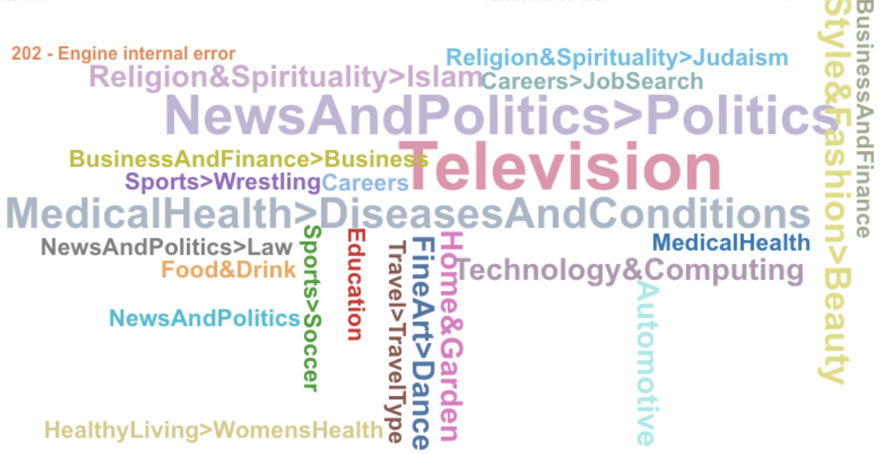
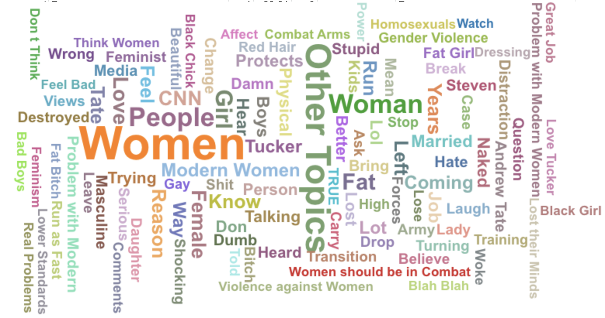
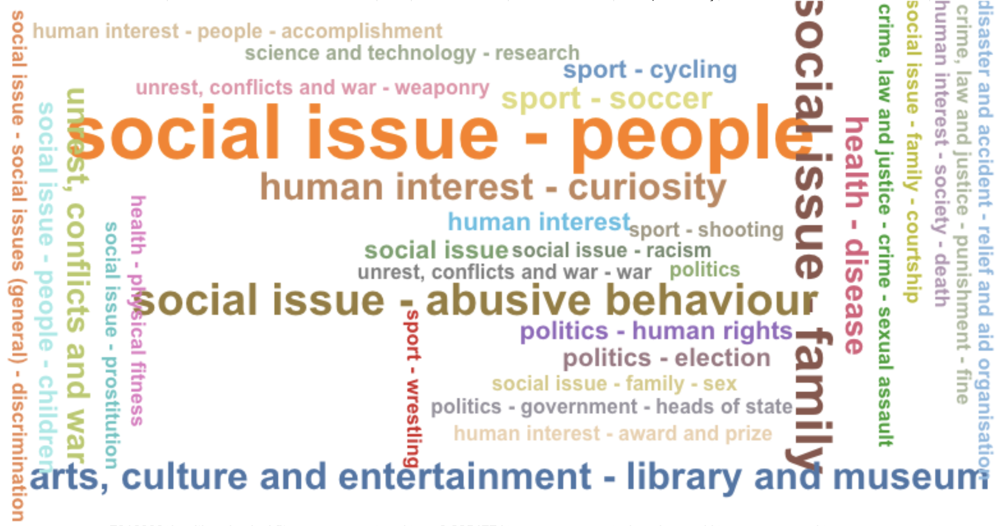
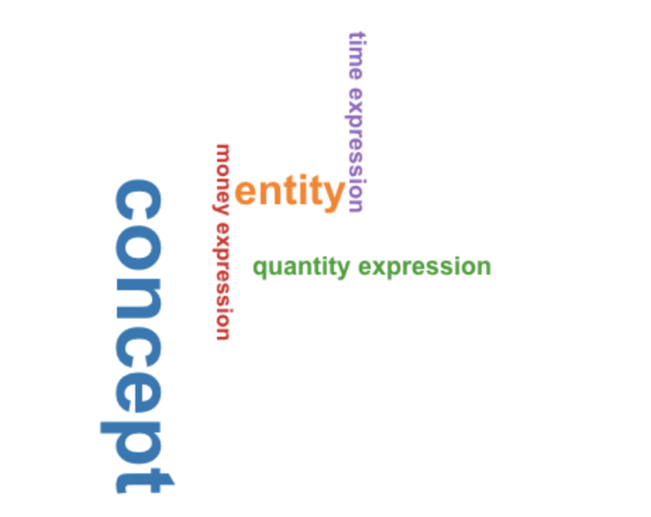

# NLP Hate Speech Detection

## About

This is my first NLP project, where I try to detect hate speech on videos relating to sexism on the right-wing platform, Rumble.

The following is a list of my initial thoughts:

- NLP can be used to automatically analyze and structure text (quickly and cost-effectively).
- Using TF-IDF vectorization, we’ll locate the most significant words in each comment section, and overall.
- Subsequently, we will train a model to classify hate speech using data extracted from the site using a decision tree.

## Scraping

Before scraping, I checked Rumble's site, which stated the following.

> "Systematic retrieval of data or Content from the Rumble Service to create or compile, directly or indirectly, a collection, compilation, library, database or directory without prior written permission from Rumble is prohibited."

Because they specified that "systematic" retrieval of data is prohibited, I needed to scrape the data manually.

As someone who loves automation, this was a tough task, but it needed to be done.

To find sexist content on Rumble, I selected five videos relating to sexism on the platform:

- [1] ["Women Should Not Be in Combat Roles: Change My Mind"](https://rumble.com/v1r74qk-women-should-not-be-in-combat-roles-change-my-mind.html)
- [2] ["The Problem With Modern Women"](https://rumble.com/v1wqypw-the-problem-with-modern-women-w-layah-heilpern-jedediah-bila-live-episode-6.html)
- [3] ["Tucker Carlson Gives CNN Some Tips About Sexism in Hilarious Segment"](https://rumble.com/vfjlp5-tucker-carlson-gives-cnn-some-tips-about-sexism-in-hilarious-segment.html)
- [4] ["WOMAN DEFENDS ANDREW TATE AND ARGUES WITH FEMINISTS AND TRANGENDERS"](https://rumble.com/v1q566l-woman-defends-andrew-tate-and-argues-with-feminists-and-trangenders-must-wa.html)
- [5] ["Massive Feminist March Against Gender Violence in Rome"](https://rumble.com/v1xflms-massive-feminist-march-against-gender-violence-in-rome.html)

I decided to select the top 50 comments on each video, which totaled 250 comments.

An advantage of manually scraping the data is that I was able to notice certain sexist comments and analyze them.

### Case Studies:

Ex.
> "Have you noticed it’s all the weird fat looking ones that hate Tate."

> "Those are some fine daughters they've been raising in Europe."

> "Women are equipped to be h*es."

> "Women today do not know what a woman is supposed to be, they are to busy trying to be like men."

<br>
The above comments show that there are different types of sexism, and that it is not always obvious. Such types seen above include employing derogatory terms, complimenting appearance, insulting appearance, and making generalizations.

<hr>

## Data Cleaning

After scraping the data, I needed to clean it. Thankfully, because I manually attained my data, it was already in a clean format, and all that I needed to do was drop the unnecessary columns.

<hr>

## Term Frequency Inverse Document Frequency (TF-IDF)

<br>
Below is how the TF (term frequency) is found:

$TF = \frac{(number\ of\ instances\ of\ word\ in\ document)}{(total\ number\ of\ words\ in\ document)}$

<br>

The following is the method to calculate the IDF (inverse document frequency):

$IDF = log(\frac{(number\ of\ documents\ in\ corpus)}{(number\ of\ documents\ containing\ term)})$

<br>

The TF-IDF is then calculated by multiplying the TF and IDF.


<hr>

Below is the function I used to find the top n words in a corpus. In our case, the corpus was the comments section of the selected videos.

First, we create a TF-IDF vectorizer object. Then, we fit the vectorizer to the corpus. After that, we create a dataframe of the top n words in the corpus, and return it to the user.


```python
def get_top_n_words(corpus, n=None):
    '''
    List the top n words in a vocabulary according to occurrence in a text corpus.
    
    Args:
        corpus (list): a list of text documents.
        n (int): number of top words to return.
    '''
    assert isinstance(corpus, list), "This must be a list!"
    assert isinstance(n, int), "This must be an integer!"

    tfidf_vectorizer = TfidfVectorizer(use_idf=True)
    tfidf_vectorizer_vectors=tfidf_vectorizer.fit_transform(corpus)
    first_vector_tfidfvectorizer=tfidf_vectorizer_vectors[1]
    df_tfidfvectorizer = pd.DataFrame(first_vector_tfidfvectorizer.T.todense(), index=tfidf_vectorizer.get_feature_names(), columns=["tfidf"])

    commentsTF_IDF = df_tfidfvectorizer.sort_values(by=["tfidf"],ascending=False)
    return commentsTF_IDF.head(n)

```

## TF-IDF Results

Below are the top 15 words in each of the five videos.

#### Video 1

```
             tfidf
more      0.270853
be        0.241720
injured   0.230368
affected  0.230368
would     0.214345
those     0.208332
their     0.206575
woman     0.206575
in        0.190632
being     0.180569
even      0.180569
by        0.180569
than      0.155024
it        0.150067
men       0.124610
```

#### Video 2
```
             tfidf
more      0.270853
be        0.241720
injured   0.230368
affected  0.230368
would     0.214345
those     0.208332
their     0.206575
woman     0.206575
in        0.190632
being     0.180569
even      0.180569
by        0.180569
than      0.155024
it        0.150067
men       0.124610
```

#### Video 3
```
             tfidf
more      0.270853
be        0.241720
injured   0.230368
affected  0.230368
would     0.214345
those     0.208332
their     0.206575
woman     0.206575
in        0.190632
being     0.180569
even      0.180569
by        0.180569
than      0.155024
it        0.150067
men       0.124610
```

#### Video 4
```
             tfidf
more      0.270853
be        0.241720
injured   0.230368
affected  0.230368
would     0.214345
those     0.208332
their     0.206575
woman     0.206575
in        0.190632
being     0.180569
even      0.180569
by        0.180569
than      0.155024
it        0.150067
men       0.124610
```

#### Video 5
```
               tfidf
their        0.37430
truckers     0.20114
leaders      0.20114
freezing     0.20114
efforts      0.20114
govt         0.20114
ottawa       0.20114
bank         0.20114
canada       0.20114
least        0.20114
arresting    0.20114
fundraising  0.20114
isn          0.20114
accounts     0.20114
associated   0.20114
```

#### Overall Top 15 Words
```
             tfidf
be        0.245173
injured   0.243024
affected  0.243024
more      0.234565
would     0.223824
woman     0.211882
in        0.198536
their     0.189318
even      0.185259
those     0.185259
being     0.175961
than      0.161941
by        0.151469
combat    0.149216
it        0.145994
```

The TD-IDF localization proved to be useful, as it shows the prevelance of words such as "woman," "injured," and "affected" in the comments. This is useful, as it shows that the users are engaged in their respective videos, and have a lot to say about women.


## Decision Tree Hate Speech Detection Model

To train the hate speech detection model, I used Kaggle's ["Hate Speech and Offensive Language Dataset."](https://www.kaggle.com/datasets/mrmorj/hate-speech-and-offensive-language-dataset) 

After importing NLTK, I loaded in the labeled Kaggle data, preprocessed it, and split it, as done in [this tutorial.](https://copyassignment.com/hate-speech-detection/)

After using scikit-learn's DecisionTreeClassifier() function, I trained the model on the data, and then tested it on the test data. The model achieved an accuracy of about 0.89, which is pretty good.

```python
binClfr = [] # list (0 or 1)
numHate = 0 # a counter for the number of hate comments
for i in range(len(commentsList)):
    inp = cv.transform([commentsList[i]]).toarray()
    if (model.predict(inp) == ['Offensive Speech']):
        binClfr.append(1) # add one if offensive
        numHate += 1
    elif (model.predict(inp) == ['No Hate and Offensive Speech']):
        binClfr.append(0) # add zero if comment is not hate speech
    else:
        binClfr.append(9) # Add 9 if output it neither (shouldn't happen; means that there's an error)
    print(model.predict(inp))
```

## Hate Speech Detection Results
```python
print("Percentage of hate speech comments: " + str(numHate/len(binClfr)))
```
The above code, meant to find the percentage of hate speech comments, yielded .26, which shows that over one quarter of the comments on these videos are hate speech.

## Conclusion

The NLP analysis conducted shows us that a significant percentage of comments on the videos relating to sexism on Rumble contain hate speech. Case studies above show that there are various types of sexism on the platform, but all in all, they come together to form a staggering 26% of the comments found on the videos.


## Bonus: Word Clouds

Using the Google Sheets extensions [MeaningCloud](https://www.meaningcloud.com/) and [ChartExpo](https://chartexpo.com/), I was able to create word clouds from extracted topics, deep categorization, text clustering, and IPTC text classification.

### Deep Categorization



### Text Clustering


### IPTC Text Classification



### Topics Extraction
